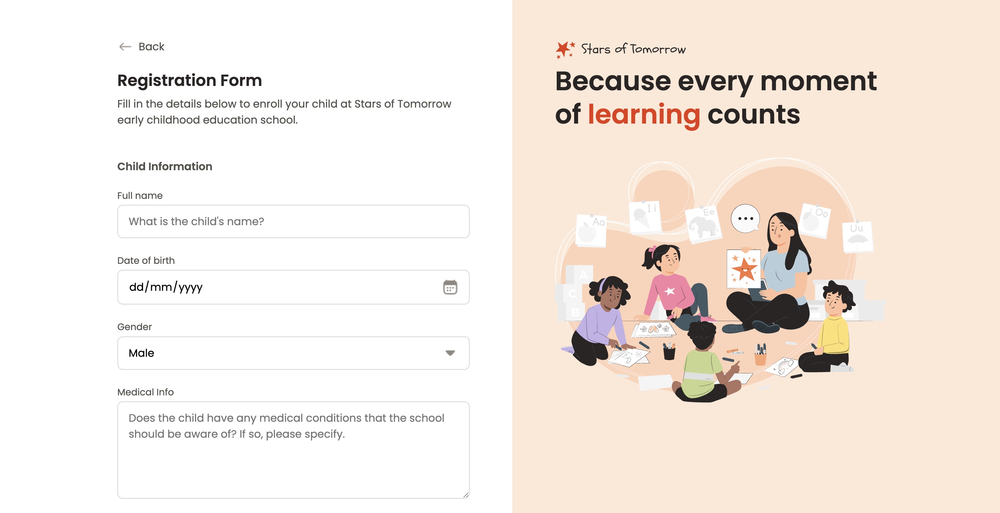

# 📄 Project Enroll Form



Welcome to **Project Enroll Form**, a fully responsive web-based registration form designed for early childhood education enrolments. This project provides an intuitive and modern interface for parents to enrol their children at **Stars of Tomorrow**.

🌐 **[Live Demo](https://rodrigovaladao.github.io/project-enroll-form/)**

---

## 🚀 Features

- **User-Friendly Registration Form** – Collects essential child, parent, and address details.
- **File Upload Support** – Allows uploading of birth certificates via a drag-and-drop interface.
- **Multiple Enrolment Options** – Parents can choose study shifts and sports activities.
- **Modern UI/UX** – Clean layout with an easy-to-use interface.

---

## 🛠 Technologies Used

- **HTML5** – Structuring the form layout.
- **CSS3** – Styling and responsive design.
- **Google Fonts** – Enhanced typography with _Poppins_.
- **Icons & SVGs** – Used for a visually appealing interface.

---

## 📂 Project Structure

```bash
project-enroll-form/
├── assets/                    # Static assets (icons, images, fonts)
│   ├── icons/                 # Form icons
│   ├── images/                # Illustrations and branding images
│   │   ├── thumbnail.png      # Project thumbnail image
│   ├── logo.svg               # School logo
│   ├── Illustration.svg        # Side panel illustration
│   └── favicon.ico            # Website favicon
│
├── styles/                    # CSS stylesheets
│   ├── global.css             # Global styles and resets
│   ├── form.css               # Specific form styling
│   ├── layout.css             # Page layout styling
│   ├── typography.css         # Font and text styles
│   └── responsive.css         # Mobile responsiveness
│
├── index.html                 # Main registration form page
├── README.md                  # Project documentation
└── .gitignore                 # Git ignore rules
```

## 📞 Contact

For inquiries or support, feel free to reach out:

- 🌐 LinkedIn: [linkedin.com/in/rodrigovaladao](https://www.linkedin.com/in/rodrigovaladao)
